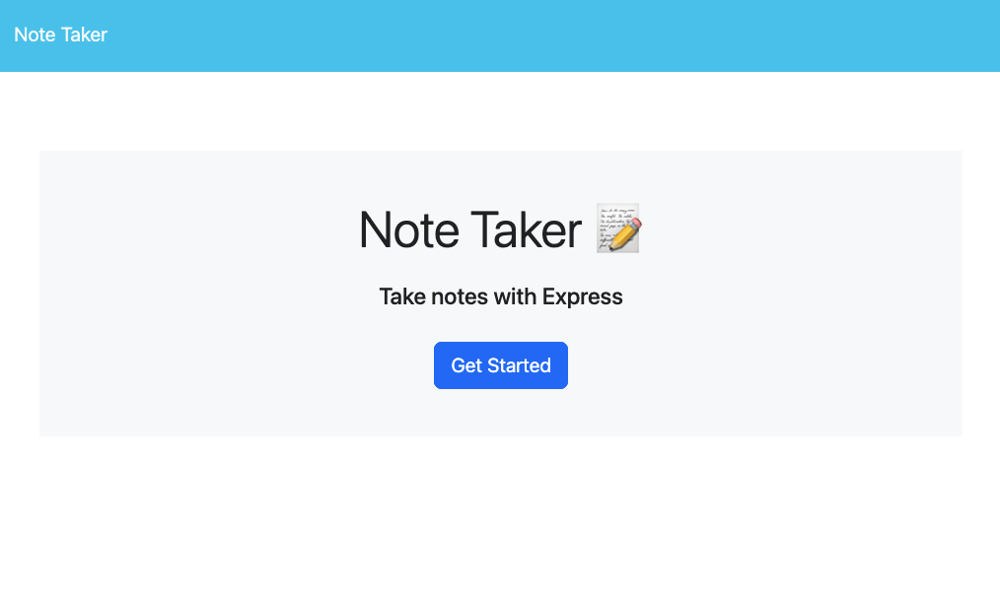

# Note Taker

A full-stack web application for creating, viewing, and managing notes with a clean, intuitive interface powered by Express.js.

## Table of Contents
- [Overview](#overview)
- [Features](#features)
- [Live Demo](#live-demo)
- [Technology Stack](#technology-stack)
- [Installation](#installation)
- [Usage](#usage)
- [API Endpoints](#api-endpoints)
- [Screenshots](#screenshots)
- [Development](#development)
- [Deployment](#deployment)
- [License](#license)
- [Contact](#contact)

## Overview

Note Taker is a web-based application that allows users to write, save, and delete notes. Built with Express.js on the back-end and vanilla JavaScript on the front-end, it provides a seamless note-taking experience with persistent data storage. The application features a responsive design and is deployed on Heroku for easy access from anywhere. 

## Features 

**- Create Notes:** Write and save notes with custom titles and content   
**- View Notes:** Browse all saved notes in an organized sidebar  
**- Delete Notes:** Remove unwanted notes with a single click   
**- Persistent Storage:** All notes are saved to JSON file storage  
**- Responsive Design:** Works seamlessly across desktop and mobile devices  
**- Real-time Updates:** Dynamic interface updates without page refreshes  
**- Cloud Deployment:** Hosted on Heroku for universal access  

## Live Demo 

[🌐 View Live Application](https://note-taker-app-a9b1e92f62cd.herokuapp.com/)

## Technology Stack 

**Back-end:**
- Node.js 
- Express.js 
- File System (fs) for data persistence 
- Custom UUID generation 

**Front-end:**
- HTML5 
- CSS3 
- Vanilla JavaScript 
- Bootstrap 5.2.3 
- Font Awesome Icons 

**Deployment:**
- Heroku

## Installation

### Prerequisites 
- Node.js (v12.0.0 or higher)
- npm (Node Package Manager) 

### Local Setup

1. Clone the repository:

```bash
git clone git@github.com:bycait27/note-taker.git 
cd note-taker
```

2. Install dependencies:

```bash 
npm install
```

3. Start the development server:

```bash 
node server.js
```

4. **Access the application:** Open your browser and navigate to `http://localhost:3001`

## Usage

### Getting Started 

1. Click the **"Get Started"** button on the landing page
2. You'll be taken to the notes interface

### Creating a Note 

1. Click the **plus icon (➕)** in the top-right corner
2. Enter a title in the **"Note Title"** field 
3. Add your content in the **Note Text** field 
4. Click the **save icon(💾)** to save your note 

### Viewing Notes 
- All saved notes appear in the left sidebar 
- Click on any note title to view its content
- The selected note will display the main content area 

### Deleting Notes 
- Click the **trash icon (️🗑️)** next to any note in the sidebar 
- The note will be permanently removed

## API Endpoints 

| Method | Endpoint | Description |
| --------------- | --------------- | --------------- |
| `GET` | `/` | Serves the landing page |
| `GET` | `/notes` | Serves the notes interface |
| `GET` | `/api/notes` | Retrieves all saved notes |
| `POST` | `/api/notes` | Creates a new note |
| `DELETE` | `/api/notes/:id` | Deletes a note by ID |


## Screenshots 

### Landing Page 

*Clean, welcoming interface with clear call-to-action*



### Notes Interface 

*Split-panel design with note list and editor*


## Development 

### Available Scripts 

```bash
# start the server 
npm start 
# or 
node server.js
```

### Environment Variables 

The application uses the following environment variable:

- `PORT`: Server port (defaults to 3001 for local development)

## Deployment

The application is configured for Heroku deployment:

1. Deploy to Heroku:

```bash
heroku create note-taker-app 
git push heroku main
```

2. Set environment variables:

```bash
heroku config:set NODE_ENV=production
```

## License 

[](https://opensource.org/licenses/MIT)  

see LICENSE file for more details

## Contact

**GitHub:** [@bycait27](https://github.com/bycait27)  
**Portfolio Website:** [caitlinash.io](https://caitlinash.io/)  
**LinkedIn:** [Caitlin Ash](https://www.linkedin.com/in/caitlin-ash/)  

---
*This project was originally created as part of my Full-Stack Developer Bootcamp program.*
